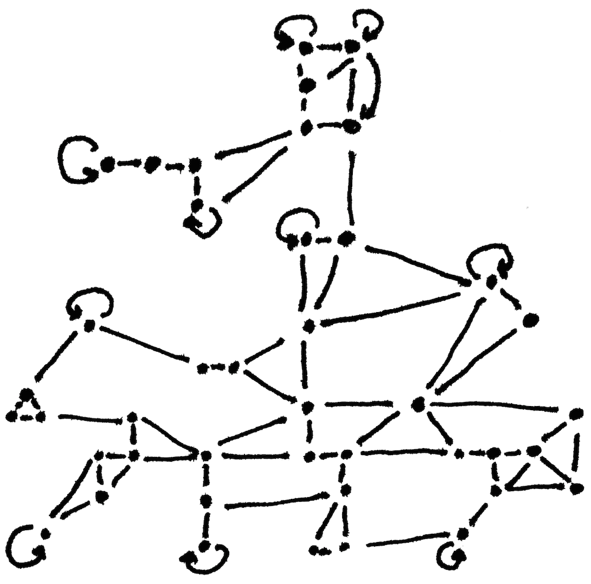

2008 financial crisis, and especially the economical policy implemented to mitigate by political bodies, revealed deep gaps in democracy quality in a lot of countries. These policies had specific effects for the south of Europe.

Coincidentally, a wave fo technological social tools has been readily available for those movements that sprung after the crash.

Similarly as the protocols on the Internet provides the illusion of a horizontal, level field in communications that where individual hosts self-organize and hierarchical power structures of the past are no longer applicable

, this is also an illusion that has affected social and political movements emerging in the recent times, and especially after 2008.

social and political movements that gained relevance after the crash found themselves with a power for organization that could outdo the articulation of their discourse,

Movements like Egyptian Revolution in 2011, the 15M Movement in Spain or OccupyWallStreet in the US spend a significant amount of energy and resources in defining the structure of their own movement as well as articulation a common discourse. 

I was involved in the 15M movement, though I also followed OWS quite closely. In the Spanish movement, the lack of political experience of a big part of its participants defined debates around structure.

Quickly, some of the most important goals of movement Participants in the movement perceived themselves as leaderless and even structureless at the start, and part of the goals of the movements was to articulate themselves.

In parallel to political debates, and attempts to articulate specific demands around a common discourse, the debate around structure and leardership, collective decision-making in the movement was one of the most active. Some of the structure political entities emerging from that movement.

The perception of corruption in the country's business and political elite made overcoming the lack of accountability and transparency one of the common debates. Therefore, the need for structures that made the wrongdoing of political and business elites accountable to citizens

Although structurelessness never seemed to be a desirable goal, the debate about leaderlessness was central. Introducing structures and process to improve accountability and minimize the negative impact of an elite