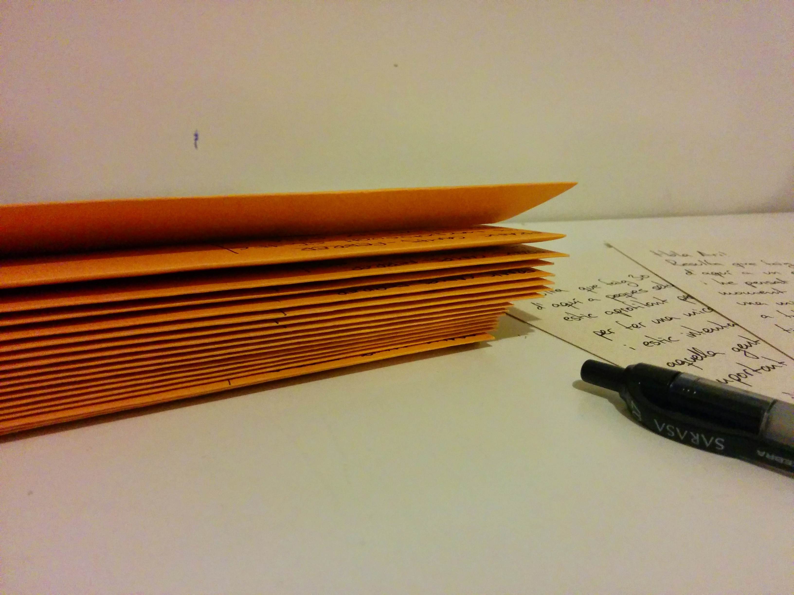
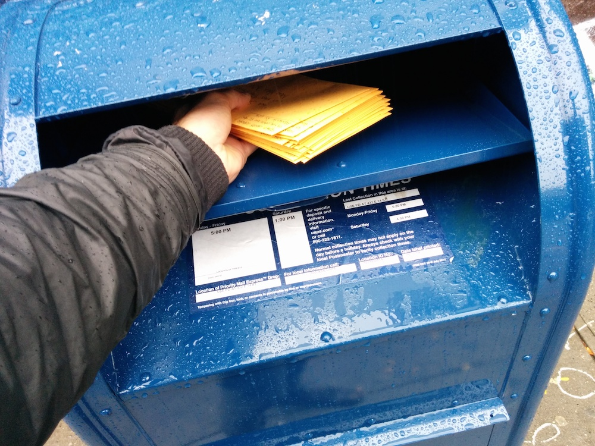

This is a personal project I did during the month of October. I was hesitant to include it on my list of projects of SFPC, because it was so personal, but I did in fact work on it for the first few weeks of the program. In a way, I also realize that it has to do with some of the questions I've been and will continue to explore around connection, biography and storytelling.

So last October I was turning 30 years old. I don't generally celebrate my birthday. Although I enjoy other people's parties, I feel self-conscious throwing a party for myself, and don't tell anyone. Some people remember sometimes, and it's nice, but it tends to go quite unnoticed, which I'm totally ok with. I'm actually enjoying getting older, but throwing a party for myself doesn't feel adequate to what I feel when ```myAge++```.

I do, however, tend to find meaning in rituals and I like stories, and I've been telling people about my birthday a bit more than normal.

Truth is, I've had a blast in my 20s. The decade has been really good with me, and I've been blessed with all sorts of adventures and experiences, too many to enumerate here.

So instead of celebrating my 30th birthday, I felt like celebrating my 20s. And instead of celebrating by throwing a party, or receiving presents, and since at this point I have people scattered all over the world, I decided to celebrate by doing a bit of a life inventory.

The idea was to go through a list of all the people who have impacted my life in one way or another, and send a letter giving thanks. It feels much more correct to celebrate by thanking people who've made my 20s happen than thanking myself for, huh, existing?

It's been an interesting exercise. I couldn't write to _everybody_, it would have been a monumental task. I tried to be honest with myself and write not only to people who I really felt like celebrating together with, but also to people who I felt a bit uncomfortable addressing on that personal level, people who did impact my life even when I did not impact theirs in any meaningful way. 

I wanted to keep it a genuinely truthful experience, with all its flaws and details.

And finally, I wrote a letter to my nephew to be kept unopened until the day he turns 20, or November 11th 2033, with some of the lessons I've learned during these 10 amazing years.

Life is good.

