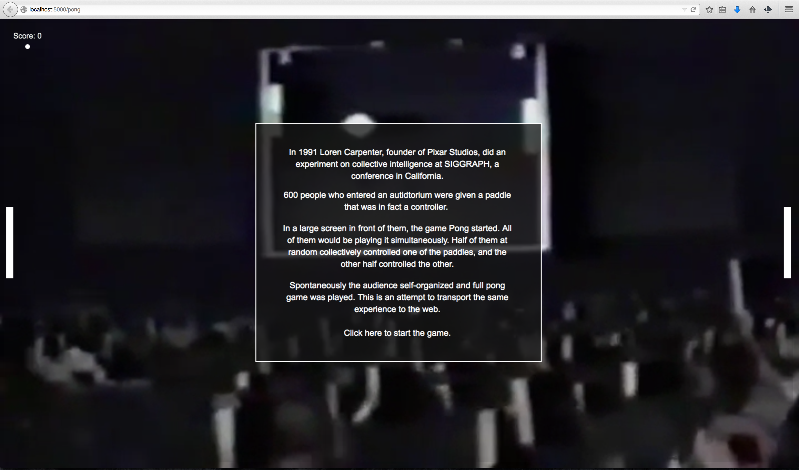

In 1991, in a computer graphics conference called SIGGRAPH celebrated in California, Loren Carpenter, founder of Pixar Animation Studios, did a very interesting experiment in collective action and decision making using the audience as participants. 

<iframe src="//player.vimeo.com/video/78043173" width="100%" height="281" frameborder="0" webkitallowfullscreen mozallowfullscreen allowfullscreen></iframe>

Thinking about communities that self-organize and how collective intelligence emerges, I became fascinated by this example. I started thinking how this would translate to the Internet.

There's been famous examples of this type of behavior, like the [Twitch Plays Pokemon](http://www.twitch.tv/twitchplayspokemon) example, but I thought that it would be nice to more specifically recreate an experiment that happened in the real world.

It would also be a great excuse to learn some Node.js and server-side programming.

The project is still on the works, but if you're feeling really desperate, you can play pong here:

...