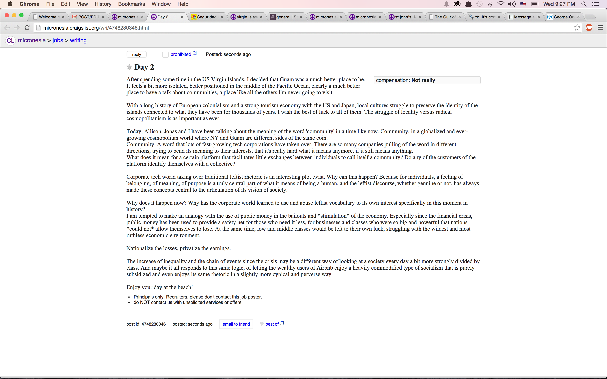
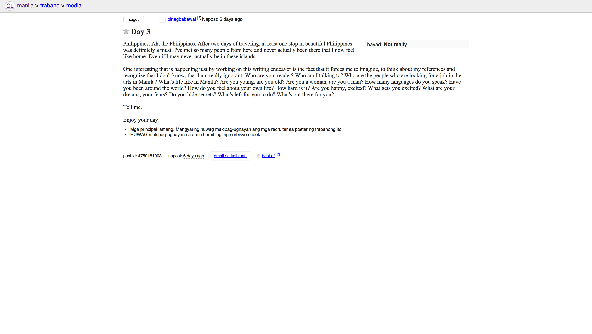
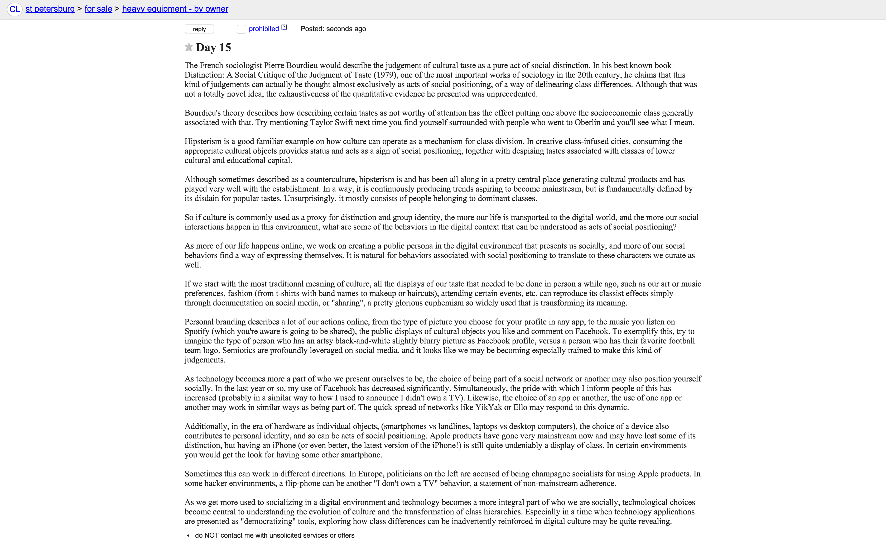

<link href="style.css" media="all" rel="stylesheet" type="text/css" />

For a month, I've been blogging in places around the world. Places that could feel abandoned, local and remote, or very alien to me. I wanted to talk to the least targeted audience, have a completely depersonalized experience. 

I've been looking at Craigslist boards around the world and looking for sections that were empty. There I would write my blog posts, out of context, unsigned, with no links.

One of the topics I've been exploring here and there at the School for Poetic Computation was that of escaping filter bubbles and expectations of the digital world about its users. The most used tools on the net provide us with personalized experiences that are tailored to our personas, but without keeping those predictions in check, we don't know what we may be missing. It was an intended way of finding peace and quiet, and not being subject to the need to match the expectations of my imaginary audience.

Of course, my writing trips were determined by those places where Craigslist had decided a board needed to exist, but it still looked deeply underused in most places I visited. Occasionally I would show up in big cities for a day, but even some big cities were empty and ghost-like, so it could also feel broken and interesting. I guess it specifically depended on Craigslist audience in the country.

It has been an opportunity to explore different ideas. On the one side, the project would make sense if it was me blogging. Like I would do on my blog. At the same time, I was secretly wishing for reactions, for some interesting responses that would validate my trip, but I only received responses in the US Virgin Islands and the Philipines.

In the end, the project would only make sense detargeting my audience completely, talking to a population that would have as little context as possible, so expecting a response was a bit dellusional.

In a way, I've been leveraging the very local nature of Craigslist. Leaving something on some of Craigslist board around the world, especially one that is very rarely transited, can be thought as the digital equivalent of going to a small town and leaving a notebook with thoughts on a rock on a forest. Maybe somebody is going to read it, maybe not, but in either case, it doesn't quite matter, because it has no possibility of spreading to become anything else. There's no context, there are no likes, no measures, no analytics.

Craigslist is ephemeral. All posts disappear in 45 days, so the disappearnace also works in that direction. Or even less, if the posts get flagged and taken down. In that sense, it's also a web installation.

I wanted to see if something happened. And then nothing happened, which is the something that happened.

  