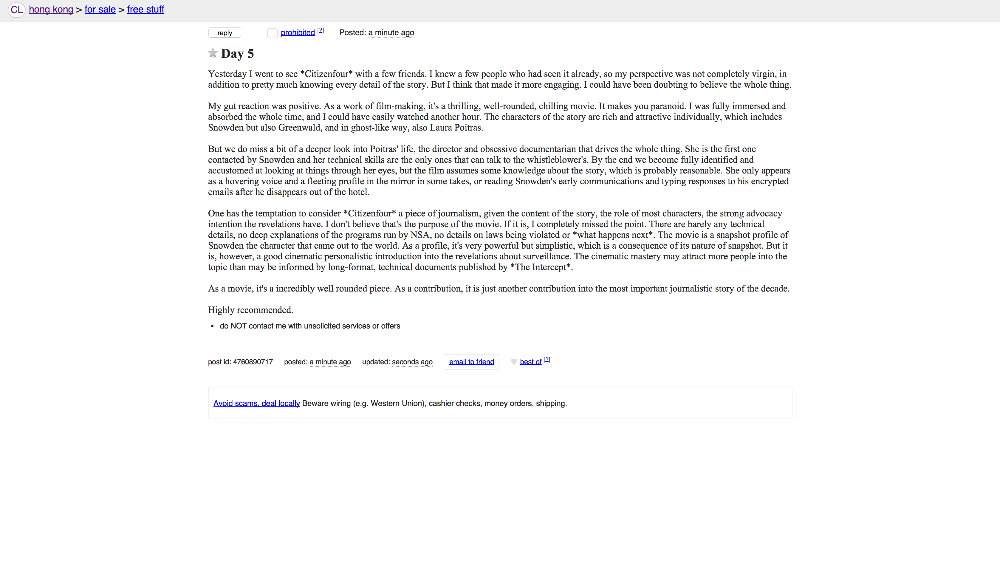
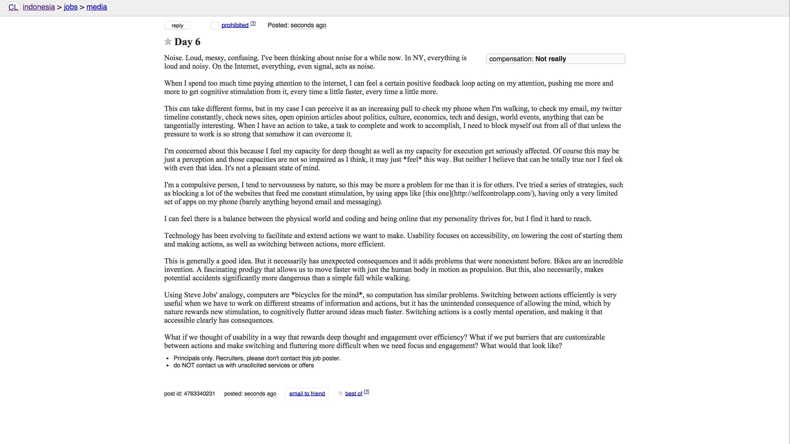

<link href="style.css" media="all" rel="stylesheet" type="text/css" />

For a month, I've been blogging in places that felt abandoned, local and remote around the world.

One of the topics I've been exploring was that of depersonalization and detargeting. The most used tools on the net provide us with personalized experiences that are tailored to the 

I've been looking at Craigslist boards around the world and look for sections that were empty. There I would write my blog posts, out of context, unsigned, with no links. 

Occasionally I would show up in big cities for a day, but even some big cities were empty and ghost-like. I guess it specifically depended on Craigslist audience in the country. It also felt broken and interesting. 

It has been an opportunity to explore different ideas. On the one side, the project would make sense if it was me blogging. Like I would do on my blog. At the same time, I was secretly wishing for reactions, for some interesting responses that would validate my trip.

I could feel a tension between continuing and wanting to write my everyday thoughts and re

The truth is the concept of the project would only make sense detargeting my audience completely, talking to a population that would have as little context as possible. so that if any people would  read the post at all, it would feel so out of place they would probably not react to it.

I now see the process as one of depersonalization, or detargeting. A way of finding peace and quite, and not being subject to the need to match the expectations of my imaginary audience.

In a way, I've been leveraging the very local nature of Craigslist. Leaving something on some of Craigslist board around the world, especially one that is very rarely transited, can be thought as the digital equivalent of going to a small town and leaving a notebook with thoughts on a rock on a forest in the outskirts. Maybe somebody is going to read it, maybe not, but in either case, it doesn't quite matter, because it has no possibility of spreading to become anything else. There's no context, there's no analyzing stats.

In addition, Craigslist is ephemeral. All posts disappear in 45 days, so the detargeting works also on the time dimension. Or even less, if the posts get flagged and taken down. In that sense, it's also an web installation. It lasts for a bit 

I wanted to see if something happened. And then nothing happened, which is the something that happened.

As with other actions, I wanted to explore disturbting on detargeting and depersonalization, escaping our filter bubbles and targetting unexpected audiences.

  