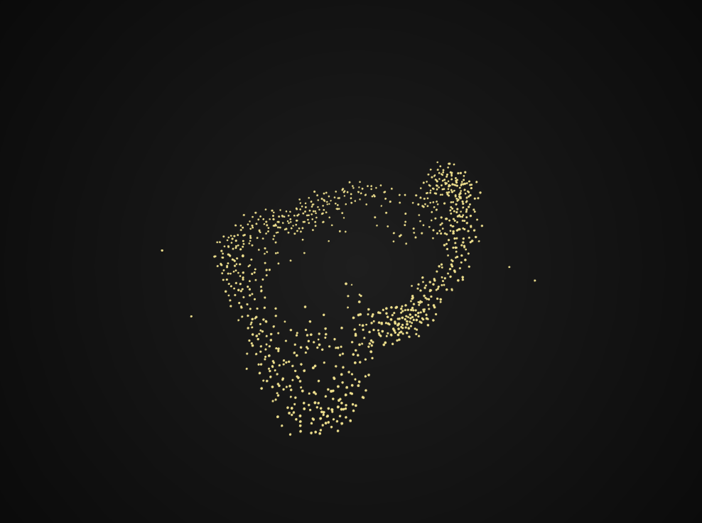
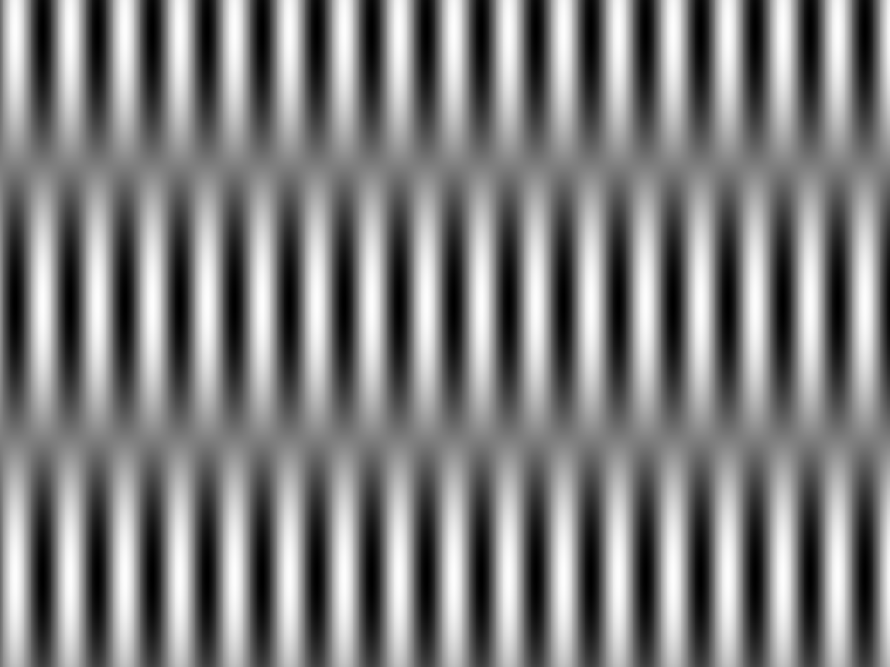

### Particle systems, John Whitney and first oF sketches

John Whitney was considered one of the fathers of computer animation. His early work is almost purely mechanical, literally, and he set the foundations for more digital work later on. Most of his stuff is slightly psychedelic 

At an animation workshop at SFPC on openFrameworks with [Zach Lieberman](http://thesystemis.com/), we've reviewed some of Whitney's work and taken it as inspiration for some experiments. Since I'm exploring particle systems and swarm behavior, this is a piece I was looking into.

<iframe src="//player.vimeo.com/video/110486548" width="500" height="369" frameborder="0" webkitallowfullscreen mozallowfullscreen allowfullscreen></iframe>

### Swarm

When thinking about emergence and collective intelligence, my quantitative self has been poaching around some particle systems. More than anything to be able to understand some models used to understand these kind of systems.

I played around with a 3D model made for Cynder and ported it to openFrameworks. I'm not very satisfied with the animation itself, but it worked to help understand relations between individual elements of larger systems.

### Image synthesis

